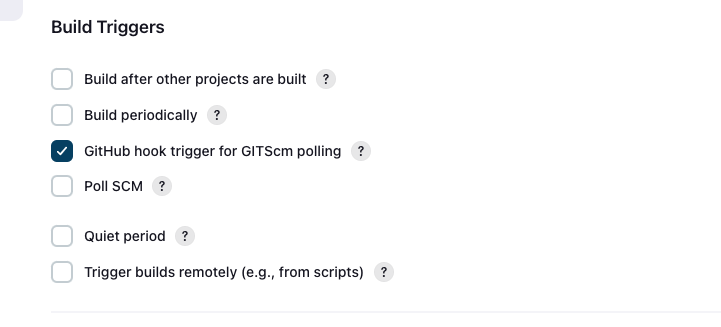
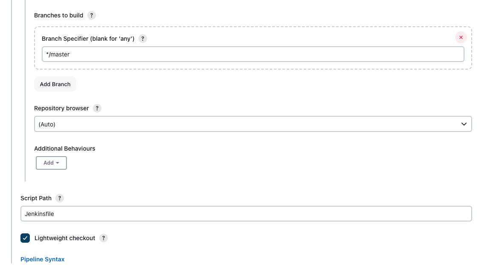
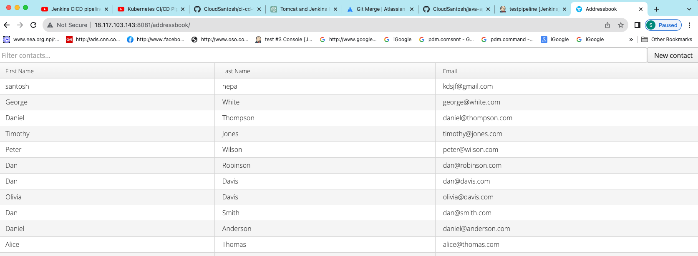

# Address Book Application using Jenkins and Github webhook on Tomcat Server

**Table of Contents:**

1. [Introduction](#Introduction)
2. [Prerequisites](#prerequisites)
3. [Setting up Jenkins](#setting-up-jenkins)
4. [Configuring GitHub Webhook](#configuring-github-webhook)
5. [Configuring Tomcat Server](#configuring-tomcat-server)
6. [Automating Deployment](#automating-deployment)
7. [Conclusion](#conclusion)

## Introduction

Deploying a Java Address Book application using Jenkins and GitHub Webhook on a Tomcat Server. In this guide, we will walk you through the process of automating the deployment of a Java-based Address Book application. By leveraging Jenkins, a popular continuous integration and continuous deployment (CI/CD) tool, along with GitHub Webhooks, we will streamline the deployment process and ensure that your application is always up-to-date.


## Prerequisites

Before we dive into the deployment process, make sure you have the following prerequisites in place:

- A Java Address Book application with a GitHub repository.
- A Jenkins server installed and configured.
- Access to a Tomcat Server where you want to deploy your application.
- Knowledge of basic Git and Jenkins concepts.

If you have these prerequisites ready, let's proceed to set up Jenkins, configure GitHub Webhook, and automate the deployment of your Java Address Book application to the Tomcat Server. This guide will help you achieve a seamless and efficient deployment process, ensuring your application is always accessible and up-to-date.

## Setting up Jenkins

In order to set up jenkins, you need to make ready with jenkins server. Here is the [github link of provisioning jenkins infrastructure](https://github.com/CloudSantosh/Jenkins_tomcat_deployment) where terraform code is used to make jenkins server ready.

#### Install jenkins on jenkin-server node

```bash

#!/bin/bash
#################################
# Author: Santosh
# Date: 8th-August-2023
# version 1
# This code install jenkins in the ubuntu instances
##################################

sudo apt update -y
sudo apt install openjdk-17-jre -y
curl -fsSL https://pkg.jenkins.io/debian-stable/jenkins.io-2023.key | sudo tee \
 /usr/share/keyrings/jenkins-keyring.asc > /dev/null
echo deb [signed-by=/usr/share/keyrings/jenkins-keyring.asc] \
 https://pkg.jenkins.io/debian-stable binary/ | sudo tee \
 /etc/apt/sources.list.d/jenkins.list > /dev/null
sudo apt-get update
sudo apt-get install jenkins -y
sudo systemctl enable jenkins
sudo systemctl start jenkins

```

(This script is on jenkins-server as data.sh and renders on EC2 instance when terraform deploy via command.)

##### Access URL

```bash
http://<public IP of Jenkins server>:8080
```

In order to access the default admin password we need to login to the jenkins server and run the command

```bash
sudo cat /var/lib/jenkins/secrets/intialAdminPassword
```

and copy & paste in the windows.

#### Create the job

steps

- Click New item
- Type name of the item
- choose Pipeline project
- Click Ok
- Select github hook trigger from GITSCM pooling for webhook
- Under pipeline Select pipeline script from SCM
- Select git
- Paste xxxxxx.git from github under repository url
- under branches to build, specify branch name, for example \*/master
- Under Script path type Jenkinsfile because in the git the pipeline scriot is stored in it.
- Select apply or save

  
  
  
  

Note: Since Jenkins server has also jenkins user and jenkins group. there jenkins user should have sudo access otherwise the following error occurs while bhuilding.

In order avoid it, we need to add following lines under /etc/sudoers.

steps

- sudo chmod 755 /etc/sudoers
- sudo nano /etc/sudoers
- add jenkins ALL=(ALL) NOPSSWD:ALL


## Configuring GitHub Webhook

steps

- Browse github repository
- Click at settings
- Click at webhook


## Configuring Tomcat Server

Tomcat is a widely used open-source application server that is used to deploy and run Java web applications. This section provides guidance on configuring Tomcat for your Java Address Book application deployment.

#### Installation

Before configuring Tomcat, ensure that you have Tomcat installed on your server. You can download the latest version of Tomcat from the [official Apache Tomcat website](https://tomcat.apache.org/). Follow the installation instructions provided for your specific operating system.

#### Configuration Files

Tomcat's configuration is primarily managed through a set of XML files located in the Tomcat installation directory. The most commonly modified configuration files include in our application is :

1. `conf/tomcat-users.xml`: This file contains configuration settings for the Tomcat server itself, such as defining management gui.

2. `conf/web.xml`: This file is used to configure global settings for web applications deployed on Tomcat, including servlet mappings, error pages, and more.

3. `conf/context.xml`: This file allows you to configure context-specific settings for web applications. You can define resources like database connections and configure context parameters.

4. `conf/catalina.policy`: This file defines security policies for web applications. It's important for securing your applications.

#### Configuring Data Sources

If your Java Address Book application requires database access, you may need to configure data sources in Tomcat. This involves defining connection pools and associating them with your web application. To configure data sources, you can typically edit the `conf/context.xml` file and add `<Resource>` elements.

```xml
<Resource name="jdbc/AddressBookDB" auth="Container" type="javax.sql.DataSource"
  maxActive="100" maxIdle="30" maxWait="10000"
  username="yourdbusername" password="yourdbpassword"
  driverClassName="com.mysql.jdbc.Driver"
  url="jdbc:mysql://localhost:3306/addressbookdb"/>
```

Replace the placeholders with your actual database details.

#### Deploying Your Application

To deploy your Java Address Book application to Tomcat, you can typically do the following:

1. Build your application WAR file using a build tool like Maven.

2. Copy the WAR file to Tomcat's `webapps` directory (e.g., `webapps/myapp.war`).

3. Start or restart Tomcat.

Tomcat will automatically deploy your application and make it accessible via the specified context path.

#### Managing Tomcat

You can start, stop, and manage Tomcat using the following commands:

- To start Tomcat: `./bin/startup.sh` (Unix/Linux) or `./bin/startup.bat` (Windows).
- To stop Tomcat: `./bin/shutdown.sh` (Unix/Linux) or `./bin/shutdown.bat` (Windows).

In order to confuring tomcat server, we have used same jenkins server to host tomcat application with port 8081.

#### Additional Resources

For more detailed information on Tomcat configuration and administration, refer to the official [Apache Tomcat documentation](https://tomcat.apache.org/documentation.html).

---

Feel free to customize this text as per your specific application and configuration requirements. Include any additional details or steps relevant to your project.

## Automating Deployment

Automating deployment is initiated by [Jenkinsfile configurtion file along with tomcat server](https://github.com/CloudSantosh/java-application/blob/master/Jenkinsfile)


## Conclusion



